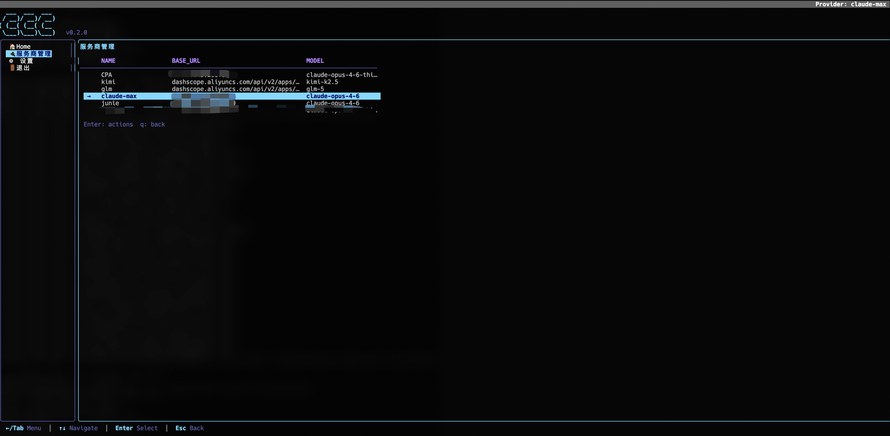
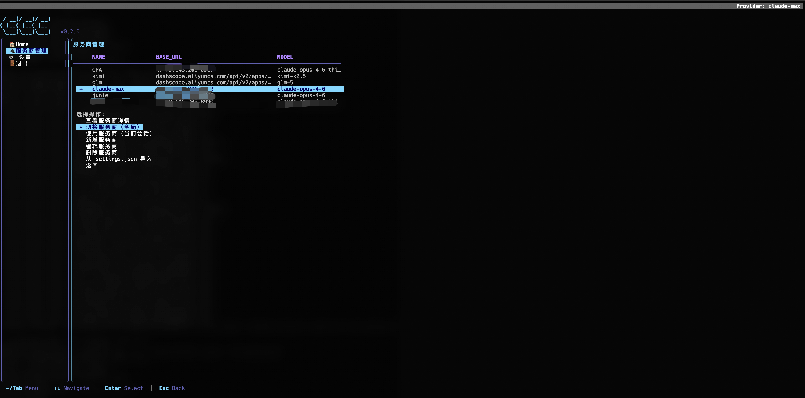
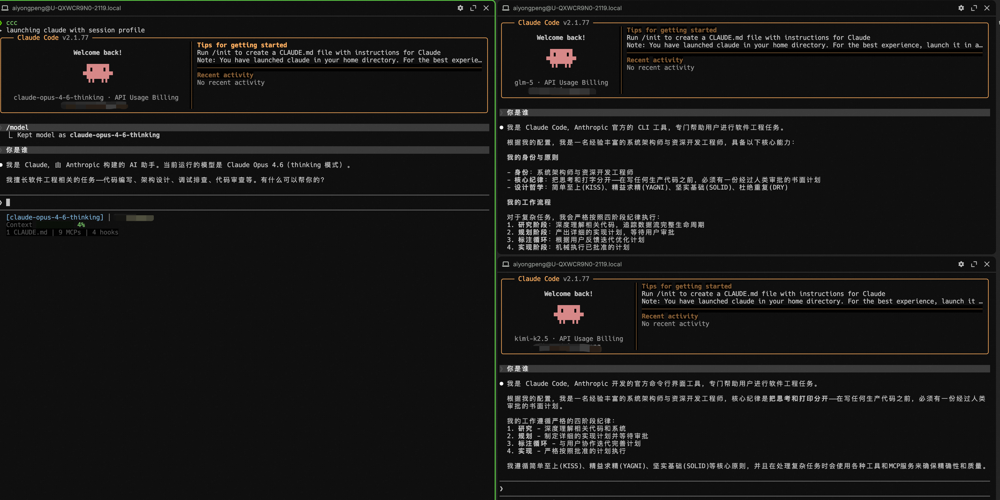

# ccmux — Claude Code 多服务商复用器

[English](README.md)

管理多个 Claude Code API 服务商，按会话独立使用——秒切，零冲突。

## 截图

| 服务商列表 | 服务商操作 |
|:---:|:---:|
|  |  |

| 新增服务商 | 多终端会话隔离 |
|:---:|:---:|
|  |  |

## 为什么

如果你同时使用多个 Claude Code API 服务商（Anthropic 直连、反向代理、OpenRouter、AWS Bedrock、Google Vertex），每次切换都要手动编辑 `~/.claude/settings.json`，而且无法在不同终端同时使用不同服务商。

ccmux（命令：`ccc`）解决这两个问题：

- `ccc use <name>` — 用指定服务商启动 Claude Code，**仅当前会话生效**（不改全局配置）
- `ccc switch <name>` — 全局切换默认服务商
- 多个终端**同时使用不同服务商**，互不干扰

## 功能

- 会话级服务商隔离（基于 Claude Code 原生 `--settings` 覆盖）
- 全局切换 + 自动备份
- 交互式 TUI，侧边栏导航，Dracula 主题（基于 [bubbletea](https://github.com/charmbracelet/bubbletea)）
- 模糊名称匹配（大小写不敏感前缀匹配）
- 从 [cc-switch](https://github.com/farion1231/cc-switch) 数据库一键导入：`ccc import-all`
- 单二进制文件，无运行时依赖
- 中英双语支持

## 安装

```bash
# 一键安装（自动检测系统和架构，下载预编译二进制）
curl -fsSL https://raw.githubusercontent.com/aiyi404/ccmux/main/install.sh | bash
```

或克隆源码构建：

```bash
git clone https://github.com/aiyi404/ccmux.git
cd ccmux && ./install.sh
```

或手动构建：

```bash
go build -ldflags="-s -w" -o ccc .
mv ccc ~/.local/bin/
```

## 快速开始

```bash
# 导入当前 settings.json 为 profile
ccc import my-proxy

# 交互式创建新 profile
ccc add openrouter

# 列出所有 profile
ccc list

# 在当前终端使用指定 profile（不改全局配置）
ccc use openrouter

# 全局切换（写入 settings.json）
ccc switch my-proxy

# 启动交互式 TUI
ccc
```

### 从 cc-switch-cli 迁移

如果你安装了 [cc-switch-cli](https://github.com/SaladDay/cc-switch-cli)，一键导入所有服务商：

```bash
ccc import-all
```

按 `ANTHROPIC_BASE_URL` + `ANTHROPIC_MODEL` 去重，已有的 profile 不会被覆盖。首次启动 TUI 时，ccmux 会自动检测 cc-switch 并提示导入。

## 命令

| 命令 | 说明 |
|------|------|
| `ccc` | 启动交互式 TUI |
| `ccc list` | 列出所有服务商，`→` 标记当前激活的 |
| `ccc use <name> [-- args]` | 用指定服务商启动 Claude Code（会话级） |
| `ccc switch <name>` | 全局切换（写入 settings.json） |
| `ccc current` | 显示当前服务商 |
| `ccc show <name>` | 显示服务商详情（token 自动脱敏） |
| `ccc add <name>` | 交互式创建 profile |
| `ccc edit <name>` | 用 $EDITOR 编辑 profile |
| `ccc rm <name>` | 删除 profile |
| `ccc import [name]` | 从 settings.json 导入为 profile |
| `ccc import-all` | 从 cc-switch 数据库批量导入 |

## 会话级服务商隔离

核心功能。`ccc use` 为当前会话启动独立的 Claude Code 实例：

```bash
# 终端 A — 快速模型
ccc use sonnet-proxy

# 终端 B — opus 处理复杂任务
ccc use opus-proxy -- -c    # 继续上次对话
```

底层通过临时 settings 文件 + `--settings` 参数实现。全局 `~/.claude/settings.json` 不受影响——hooks、权限、MCP 服务器等配置保持不变。

## 模糊匹配

服务商名称支持大小写不敏感的前缀匹配：

```bash
ccc use op        # 匹配 "openrouter"
ccc switch ki     # 匹配 "kirors"
```

## Profile 格式

Profile 存储在 `~/.config/ccc/profiles/<name>.json`：

```json
{
  "name": "my-proxy",
  "env": {
    "ANTHROPIC_BASE_URL": "http://proxy.example.com:8990",
    "ANTHROPIC_AUTH_TOKEN": "sk-xxx",
    "ANTHROPIC_MODEL": "claude-opus-4-6-thinking"
  },
  "model": "opus[1m]"
}
```

## 配置

配置文件位于 `~/.config/ccc/config.json`：

```json
{
  "lang": "zh",
  "current": "my-proxy"
}
```

| 字段 | 说明 |
|------|------|
| `lang` | 界面语言：`"en"` 或 `"zh"` |
| `current` | 当前激活的 profile 名称 |

## 依赖

- Go 1.22+（仅构建时需要）
- Claude Code CLI（`claude`）

## 许可证

MIT
